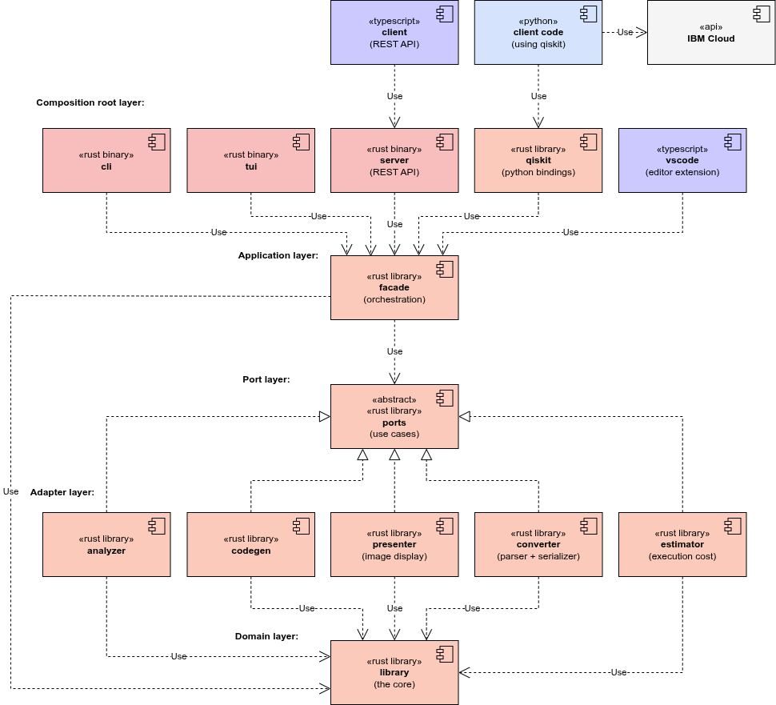
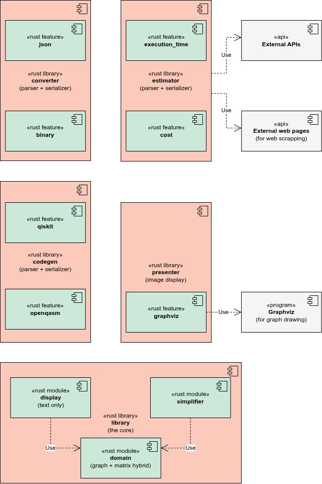

# QCTidy

A toolset for quantum circuit simplification written in Rust, with an emphasis on code quality and understandability.

It started as an enhanced port of a previous prototype that was written in Python. The new version uses Rust to provide these benefits:

- Better performance and memory usage, because it's compiled to native code and uses zero-cost abstractions.
- More reliability due to Rust's stronger type system and ownership model.
- More robust error handling and null-safety due to Rust's `Result` and `Option` types.
- Occasional code simplification thanks to Rust's macro system.
- The same interface as before can be kept for Python users by providing PyO3 bindings.

## Table of Contents

- [Features](#features)
- [Installation](#installation)
- [Project Structure](#project-structure)
- [Project Architecture](#project-architecture)
- [Useful Commands](#useful-commands)
- [Usage](#usage)
  - [Docker](#docker)
  - [Rust Library](#rust-library)
  - [Python Bindings for Qiskit](#python-bindings-for-qiskit)
  - [Supported Gates](#supported-gates)
- [Contributing](#contributing)
  - [Coding Conventions](#coding-conventions)
- [License](#license)

## Features

- **Graph-based circuit representation**: quantum circuits are modelled as a hybrid directed graph / 2D matrix (`Graph`), where each qubit is a row and each "time step" is a column.
  - This structure allows easy analysis and manipulation.
  - The directed graph is used to store semantic relationships between nodes (e.g., control or target qubits).
  - The 2D matrix is used to speed up element access by position.

- **Rich gate support**: 26 gates are available, including:
  - Single-qubit gates (ID, H, X, Y, Z, P, RX, RY, RZ, S, SDG, SX, SY, T, TDG, U, Measure).
  - Two-qubit gates (Swap, CH, CX, CY, CZ, CP).
  - Three-qubit gates (CSwap / Fredkin, CCX / Toffoli, CCZ).

- **Fluent builder API**: `GraphBuilder` provides a safe, chainable interface for constructing circuits without touching the graph internals directly.
  - Any circuit built by using the builder is guaranteed to be internally consistent.

- **Python bindings**: They are exposed as a Python extension module via [PyO3](https://pyo3.rs). So far there are bindings for:
  - [Qiskit](https://www.ibm.com/quantum/qiskit), in [crates/qiskit](crates/qiskit).

- **CLI**: Command-line interface for loading and processing circuits.

- **Multi-format serialization**: circuits can be parsed and serialized as CBOR, JSON, MessagePack or XML, and saved to or loaded from disk.

## Installation

TODO.

## Project Structure

The project is composed of various Rust crates, which focus on making it modular and extensible. A facade exposes all the common use cases so that client implementations don't have to worry about the internal details.

```plain
├── AGENTS.md           # Documentation for code agents
├── Cargo.lock          # Global lockfile
├── Cargo.toml          # Cargo workspace root, each crate also has its own Cargo.toml
├── prek.toml           # Configuration for pre-commit hooks
├── README.md           # Project description (you are reading this)
├── rustfmt.toml        # Configuration for code formatting
├── crates              # Workspace member crates
│   ├── analyzer        # Circuit analysis and metrics (library)
│   ├── cli             # Command-line interface (binary)
│   ├── codegen         # Code generator (library)
│   ├── converter       # Circuit parser and serializer for various formats (library)
│   ├── estimator       # Circuit execution time and cost estimation (library)
│   ├── facade          # Facade for client implementation (library)
│   ├── library         # The core of QCTidy (library)
│   ├── ports           # Ports for optional services (library)
│   ├── presenter       # Circuit and graph visualization (library)
│   ├── qiskit          # Python + Qiskit bindings via PyO3 (library)
│   ├── server          # Server implementation as a REST API (binary)
│   └── tui             # Terminal user interface (binary)
├── docs                # Documentation for the project
│   ├── CHANGELOG.md    # Release notes
│   ├── CHANGES.md      # Changes from the original Python prototype
│   ├── CONVENTIONS.md  # Repository guidelines and code conventions
│   └── SPEC.md         # Requirements specification
└── images              # Images used in the documentation
```

## Project Architecture

The architecture of the project is based on the [hexagonal architecture](https://alistair.cockburn.us/hexagonal-architecture), and is used to separate ports and adapters, which decouples the facade from the optional service crates.

### High level architecture



### Low level architecture



## Useful Commands

The project includes a `justfile` with common commands, for ease of use. Run `just` or `just --list` to see all the available recipes.

Some commonly used commands:

| Just Recipe          | Cargo Equivalent                    | Purpose                                  |
| -------------------- | ----------------------------------- | ---------------------------------------- |
| `just format`        | `cargo fmt`                         | Auto-format all source files.            |
| `just lint`          | `cargo clippy --workspace`          | Lint code in all the crates.             |
| `just check`         | `cargo check --workspace`           | Check that all the crates compile.       |
| `just build`         | `cargo build --workspace`           | Compile a debug build of all the crates. |
| `just build-release` | `cargo build --release --workspace` | Compile an optimized release build.      |
| `just test`          | `cargo test --workspace`            | Run all unit and integration tests.      |
| `just bench-sysinfo` | `cargo run -p benchmarks --bin sysinfo` | Save the hardware/OS specs to JSON for benchmarks. |

If for some reason you don't want to use Just, you can read the contents of the [justfile](justfile) for more common examples.

## Usage

### Docker

Run the backend and frontend together with Compose:

```bash
docker compose up --build
```

The frontend is available at `http://localhost:5173` and the backend at `http://localhost:3000`. Customize the published ports with environment variables:

```bash
FRONTEND_PORT=8081 SERVER_PORT=8080 docker compose up --build
```

#### Backend only

```bash
docker build -f server.Dockerfile -t qctidy-server .
docker run --rm -p 3000:3000 qctidy-server
```

Use another host port if needed:

```bash
docker run --rm -p 8080:3000 qctidy-server
```

#### Frontend only

The frontend container reaches the backend through a shared Docker network, using the backend container name as the host:

```bash
docker network create qctidy-net

docker build -f server.Dockerfile -t qctidy-server .
docker run --rm -d --name qctidy-server --network qctidy-net -p 3000:3000 qctidy-server

docker build -f frontend.Dockerfile -t qctidy-frontend .
docker run --rm -d --name qctidy-frontend --network qctidy-net -p 5173:80 \
  -e API_URL=http://qctidy-server:3000 qctidy-frontend
```

The frontend is available at `http://localhost:5173`. To stop the containers and remove the network:

```bash
docker rm -f qctidy-server qctidy-frontend
docker network rm qctidy-net
```

### Rust Library

TODO.

### Python Bindings for Qiskit

TODO.

### Supported Gates

Each gate has a canonical name, and parsers also accept the aliases listed below (case-insensitive).

| Qubits | Gate      | Description                   | Aliases                                  |
| ------ | --------- | ----------------------------- | ---------------------------------------- |
| 1      | `ID`      | Identity                      | `i`, `identity`                          |
| 1      | `H`       | Hadamard                      | `hadamard`                               |
| 1      | `X`       | Pauli-X (NOT)                 | `not`                                    |
| 1      | `Y`       | Pauli-Y                       |                                          |
| 1      | `Z`       | Pauli-Z                       |                                          |
| 1      | `P`       | Phase                         | `phase`                                  |
| 1      | `RX`      | Rotation around X axis        |                                          |
| 1      | `RY`      | Rotation around Y axis        |                                          |
| 1      | `RZ`      | Rotation around Z axis        |                                          |
| 1      | `S`       | S (√Z)                        | `sz`, `sqrtz`                            |
| 1      | `SDG`     | S dagger (S†)                 | `sd`, `szd`, `szdg`, `sqrtzd`, `sqrtzdg` |
| 1      | `SX`      | √X                            | `sqrtx`                                  |
| 1      | `SY`      | √Y                            | `sqrty`                                  |
| 1      | `T`       | T                             |                                          |
| 1      | `TDG`     | T dagger (T†)                 | `td`                                     |
| 1      | `U`       | General unitary (θ, φ, λ)     | `u3`                                     |
| 1      | `Measure` | Measurement                   | `m`                                      |
| 2      | `Swap`    | SWAP                          |                                          |
| 2      | `CH`      | Controlled Hadamard           |                                          |
| 2      | `CX`      | Controlled X (CNOT)           | `cnot`                                   |
| 2      | `CY`      | Controlled Y                  |                                          |
| 2      | `CZ`      | Controlled Z                  |                                          |
| 2      | `CP`      | Controlled phase              | `cphase`                                 |
| 3      | `CSwap`   | Controlled SWAP (Fredkin)     | `fredkin`                                |
| 3      | `CCX`     | Doubly-controlled X (Toffoli) | `ccnot`, `toffoli`                       |
| 3      | `CCZ`     | Doubly-controlled Z           |                                          |

## Contributing

1. Fork the repository and create a feature branch.
2. Follow the coding conventions below.
3. Submit a pull request.
4. Wait for all the checks to pass and for the changes to be approved.

### Coding Conventions

Check the [CONVENTIONS.md](docs/CONVENTIONS.md) file for a detailed list of repository and coding conventions.

## License

Similar to many popular Rust projects, this is licensed under either of:

- Apache License, Version 2.0 ([LICENSE-APACHE](LICENSE-APACHE))
- MIT license ([LICENSE-MIT](LICENSE-MIT))

at your option.

Unless you explicitly state otherwise, any contribution intentionally submitted for inclusion in this project by you, as defined in the Apache-2.0 license, shall be dual licensed as above, without any additional terms or conditions.
